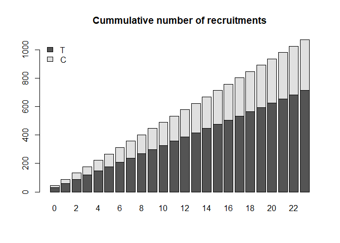

<!-- README.md is generated from README.Rmd. Please edit that file -->

# BSSRed (Blinded Sample Size Reestimation with Evnt-Driven Data.)

<!-- badges: start -->

<!-- badges: end -->

The goal of BSSRed is to provide the methods published by T. Friede et
al. (Friede and Schmidli 2010), which main aspect lies on reestimation
procedures.

## Installation

You can install the released version of BSSRed from
[GITHUB](https://github.com/ChristophAnten/BSSRed) with:

``` r
library("devtools")
install_git(url="https://github.com/ChristophAnten/BSSRed.git",
            upgrade=FALSE)
library("BSSRed")
```

## Study Exapmle

This is a basic example to evaluate and varify a study plan with event
driven data.

For this example it is assumed, that we have some prior information from
other studies on witch we base our assumptions on the hazard and drop
out rates.

We assume, that 30% of the patients in the control group have an event
after 24 month and 20% of the patients across both group drop out of the
study within 24 month. Assuming a 30% reduction of hazard in the
treatment group.

``` r
library(BSSRed)

# assumed reduction of hazard by 30% 
# defining the hazard ratio 'theta'
theta = 1-.3

# hazard rate of control group is 30% after 24 month
lambdaC <- get_hazardRate(.3,24)
lambdaC
#> [1] 0.01486146

# the treatment group has a reduction of 30% after 24 month
lambdaT <- lambdaC*theta
lambdaT
#> [1] 0.01040302

# the overall dropout proportion is 20% after 24 months
gamma <- get_hazardRate(.2,24)
gamma
#> [1] 0.009297648
```

With a nominal alpha niveau of 5% (two-sided), the study aims for a
power of 90%. The treatment allocation is planned to be 2:1
(treatment:control). With these additional assumptions we can calculate
the required number of events to achive the targetet power as follows.

``` r
library(BSSRed)

# define the alpha and beta error
alpha = .05
beta = .1

# set the alternative 
alternative = "two-sided"

# define the allocation parameter
k=2

# calculating the required number of events
nEvents <- nschoenfeld(theta = theta, k=k, alpha=alpha, beta=beta, alternative = "two-sided")
nEvents
#> [1] 371.6752

nEvents <- ceiling(nEvents)
nEvents
#> [1] 372
```

The recruitment is assumed to be linear with with a total of 1071
patients and an treatment allocation of 2:1 (tratment:control). The
recruitment is assumend to be available at the start of each month.

``` r

# define the recruitment table
N_recruit <- set_recruitment(targetN=1071, k=2, timePoints=0:23)
head(N_recruit,5)
#>    T  C time
#> 1 30 15    0
#> 2 29 15    1
#> 3 30 15    2
#> 4 30 14    3
#> 5 30 15    4

colSums(N_recruit[,c("T","C")])
#>   T   C 
#> 714 357

# short overview of recruitments
barplot(names.arg =N_recruit$time,height=(t(cumsum(N_recruit[,c("T","C")]))),
        main = "Cummulative number of recruitments",col=c("grey33","grey88"))
legend("topleft",legend = c("T","C"),fill = c("grey33","grey88"),bty="n")
```



The study is planned to run for 48 months. With these information we can
check if our recruitments will suffice to achieve the calculated number
of events ‘nEvent’ before 48 months.

``` r

# define the administrative censoring at the end of the study
L = 48

# calculate expected number of events
calc_expEvents(N_recruit[,1:2],theta,L,N_recruit[,3],lambdaC,gamma = gamma)
#>         T         C 
#> 254.79327  95.80526
```

Thes are not enough events to hold the assumptions. So we can check
weather we can reach the targeted number of events by adding some mor
recruitments

``` r
# that is not enough we need
rEstimate(N=N_recruit[,1:2], tn=N_recruit[,3], theta=theta, nEvents=nEvents, L=L,
                  lambda=lambdaC, gamma = gamma, distC="exponential",distS="exponential")
#> $rec_batch
#> [1] 26
#> 
#> $rec_time
#> [1] 25
#> 
#> $rec_total_number
#>   T   C 
#> 774 387
```

So we need to recruit 1161 patients or we need 26 batches of recruits.
The last recruitment arrives at timepoint 25.

<div id="refs" class="references">

<div id="ref-friede2010blinded">

Friede, Tim, and Heinz Schmidli. 2010. “Blinded Sample Size Reestimation
with Count Data: Methods and Applications in Multiple Sclerosis.”
*Statistics in Medicine* 29 (10): 1145–56.

</div>

</div>
